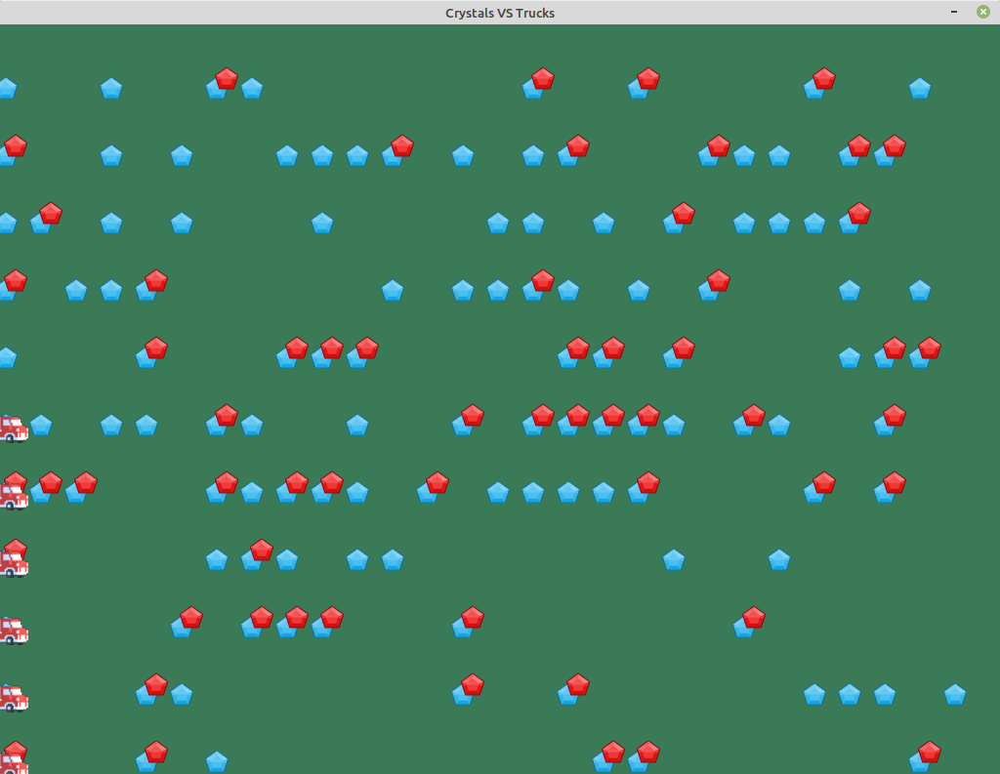

# Crystals VS Trucks

This is a game replay player for a text game. With some trucks, you have to collect
crystals the fastest way.



The images are from https://www.kenney.nl,
under Creative Commons Zero (CC0) http://creativecommons.org/publicdomain/zero/1.0/.

## Command line interface

```
usage: viewer.py [-h] (-i PATH | -s COM1)

Viewer for crystals vs trucks.

optional arguments:
  -h, --help            show this help message and exit
  -i PATH, --input PATH
                        path of the file containing commands
  -s COM1, --serial-port COM1
                        name of the serial device (115200 8N1)
```

## Viewer keys

- Left arrow: go back one turn earlier in time
- Right arrow: go one turn later in time
- Up arrow: accelerate time
- Down arrow: decelerate time
- Space: pause

## Rules

A game description is provided. For instance:

```
trucks: 6
width: 28
height: 11
### Grid ###
2   2 1          22       2 
1   21       2  2      111 1
  1    2 222   2       2    
  2     121 11       1  1   
 222   21221 2 11112    2 2 
21 11 21  1  2 22221 21  2  
 1   2   222     22 2    122
 2 112      1 1121 1 2   1 1
   12 1 1   1    11 1 2 1112
2  1 1  1112 1 12   211 22  
1  1  21       2  2    2  1 
### End Grid ###

Start!
```

This means that you have:

- 6 trucks
  - the first is at (x=0, y=0)
  - the second is at (x=0, y=1)
  - the third is at (x=0, y=2)
  - …
  - the n-th is at (x=0, y=n-1)
- a 28-cell wide crystals grid
- a 11-cell tall crystals grid
- the crystals grid content, one character per cell
  - space: 0 crystal
  - 1: 1 crystal
  - 2: 2 crystals

You have to provide commands for the trucks. The command syntax is:

```
turn ACTION truck_id arguments
```

where:

- turn is the number of game cycles, each truck can provide a command per turn
- ACTION is the action done by the truck
- truck_id is the index of the truck
- arguments are the arguments of the command

For instance:

```
3 MOVE 1 0 2
```

means that during the third turn, the truck \#1 moves to cell (x=0, y=2).

Below are the possible actions.

### MOVE

```
turn MOVE truck_id cell_x cell_y
```

Moves the truck_id-th truck to cell (x=cell_x, y=cell_y). The truck can go through only one cell at a time. If the target cell is too far away, the truck will advance towards the target cell, but will go through only one cell.

### DIG

```
turn DIG truck_id cell_x cell_y
```

The truck_id-th truck digs the cell (x=cell_x, y=cell_y). If the truck is not on the target cell, the command is ignored. If the truck is on the target cell, and if at least one crystal is present in the cell, then one crystal is collected.

## Sample text

```
trucks: 6
width: 28
height: 11
### Grid ###
2   2 1          22       2 
1   21       2  2      111 1
  1    2 222   2       2    
  2     121 11       1  1   
 222   21221 2 11112    2 2 
21 11 21  1  2 22221 21  2  
 1   2   222     22 2    122
 2 112      1 1121 1 2   1 1
   12 1 1   1    11 1 2 1112
2  1 1  1112 1 12   211 22  
1  1  21       2  2    2  1 
### End Grid ###

Start!
1 DIG 5 0 5
2 DIG 0 0 0
3 MOVE 1 0 1
3 MOVE 2 0 1
3 MOVE 3 0 2
3 MOVE 4 0 3
3 MOVE 5 0 6
3 MOVE 0 0 1
4 MOVE 1 0 2
4 MOVE 2 0 2
4 MOVE 3 0 3
4 MOVE 4 0 4
4 MOVE 5 0 7
4 MOVE 0 0 2
5 MOVE 1 0 3
5 MOVE 2 0 3
5 MOVE 3 0 4
5 MOVE 4 0 5
5 MOVE 5 0 8
5 MOVE 0 0 3
6 MOVE 1 0 4
6 MOVE 2 0 4
6 MOVE 3 0 5
6 MOVE 4 0 6
6 MOVE 5 0 9
6 MOVE 0 0 4
7 MOVE 1 0 5
7 MOVE 2 0 5
7 MOVE 3 0 6
7 MOVE 4 0 7
7 MOVE 0 0 5
8 MOVE 1 0 6
8 MOVE 2 0 6
8 MOVE 3 0 7
8 DIG 5 0 9
8 MOVE 0 0 6
```
